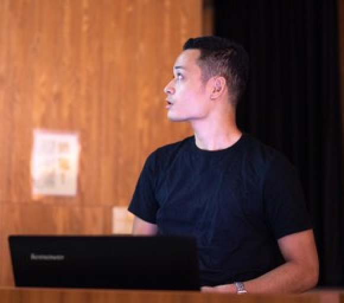

Kosei Ide is a Software Engineer at tokyo.

Projects
--------

Certificates
--------
- Graduated Security Mini Camp 2017
- Graduated CODE BASE Programming Boot Camp
- Graduated Faculty of Science, University of the Ryukyus.

Conference
--------
- YAPC OKINAWA 2018 (Core Member)
- CODE BLUE 2017 (Student Staff)

Internship
--------
- Cookpad Inc.
- Persol Proces&Technology Inc.
- Minnano Wedding Co., Ltd.

Miscellany
--------
-[blog](https://medium.com/@kos31de)/[github](https://github.com/kos31de)/[linkedin]()/kos31de at gmail.com

Last update: May 2019